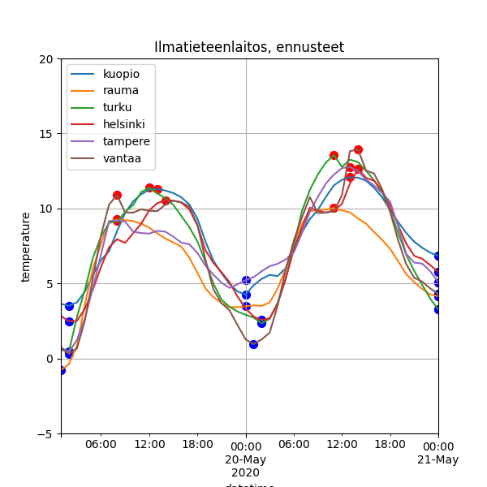

# Weather forecast

## Overview

App uses open data from ilmatieteenlaitos and makes forecast graphs. Data fully supplied by ilmatieteenlaitos.

## TBI

* Automated quary formatting
* Implement _OGC WFS_ Python library for quaries

## Images

